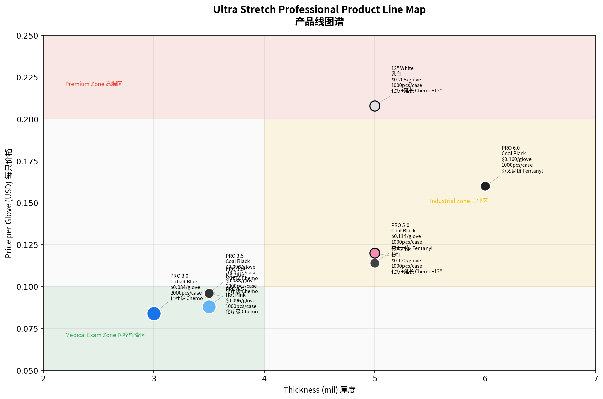
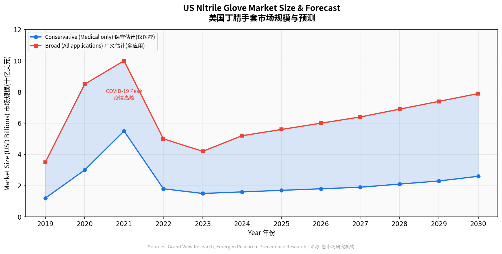
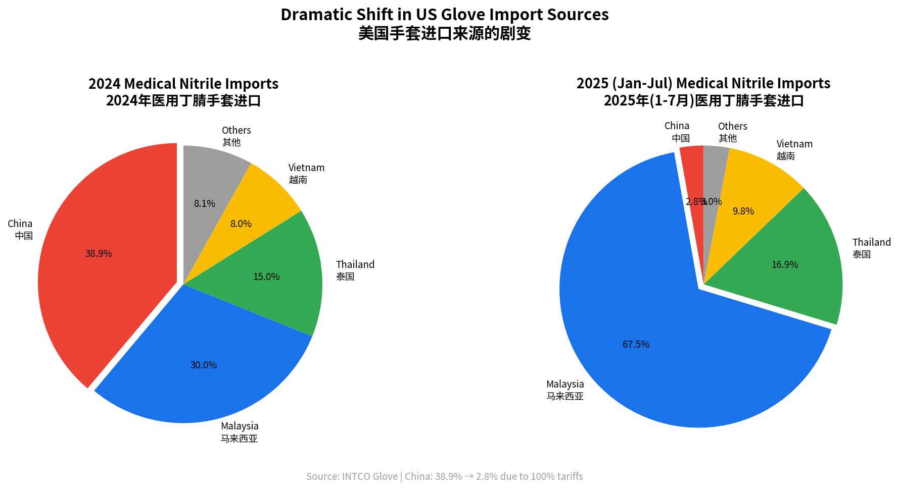
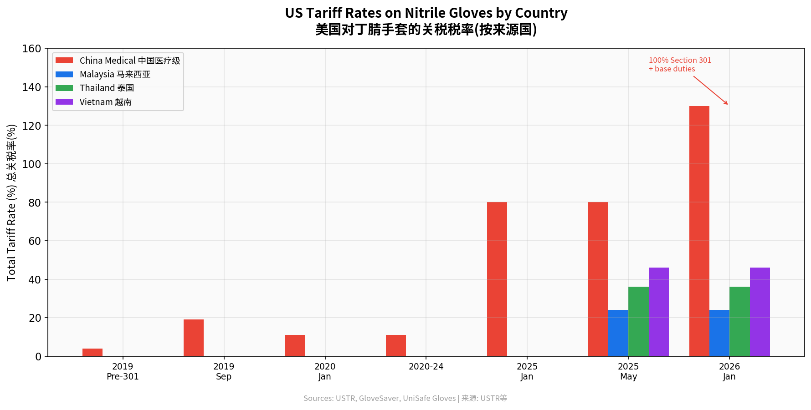
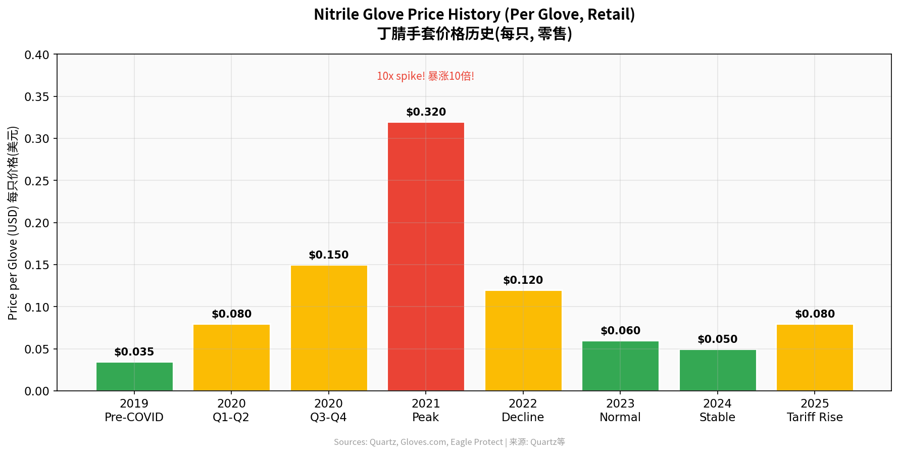
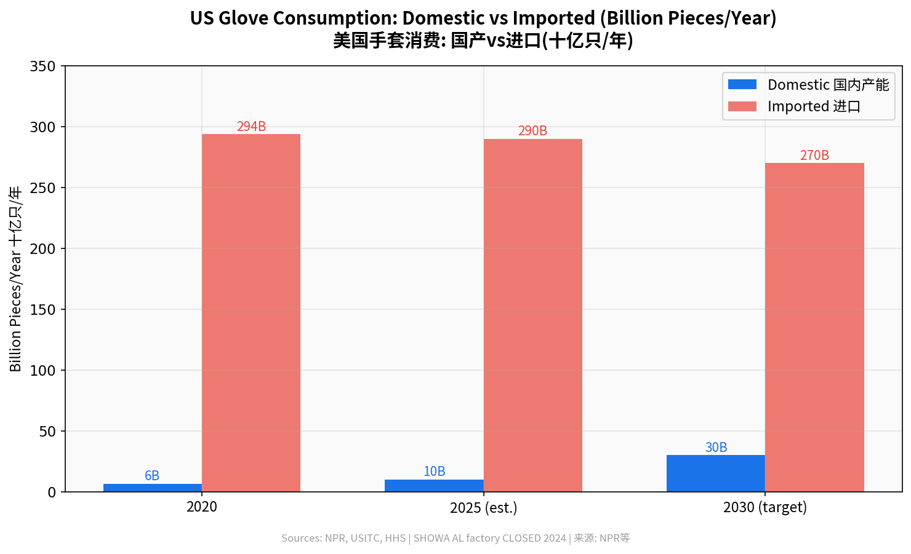
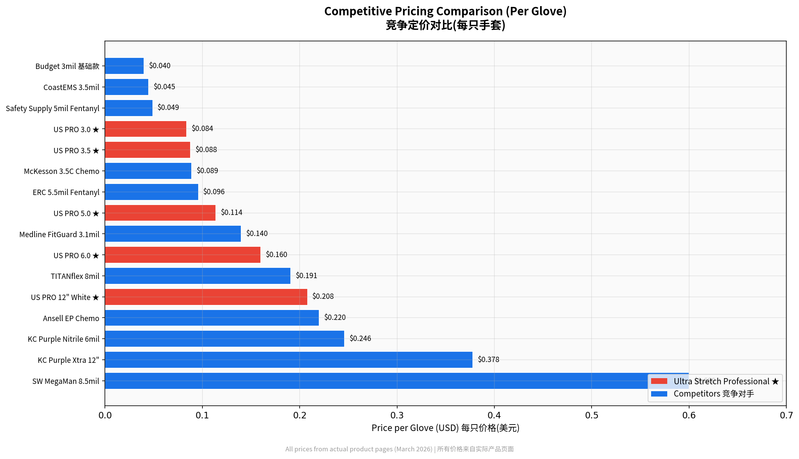
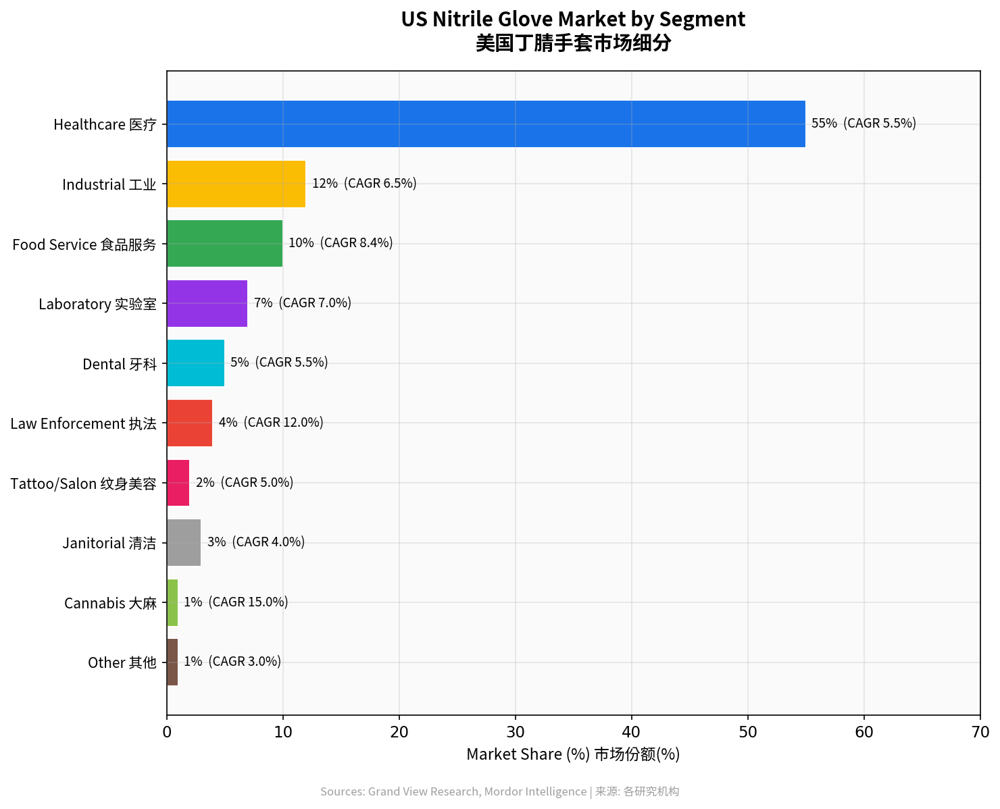
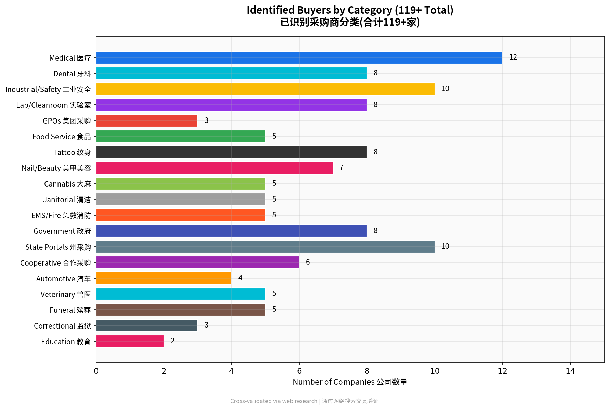
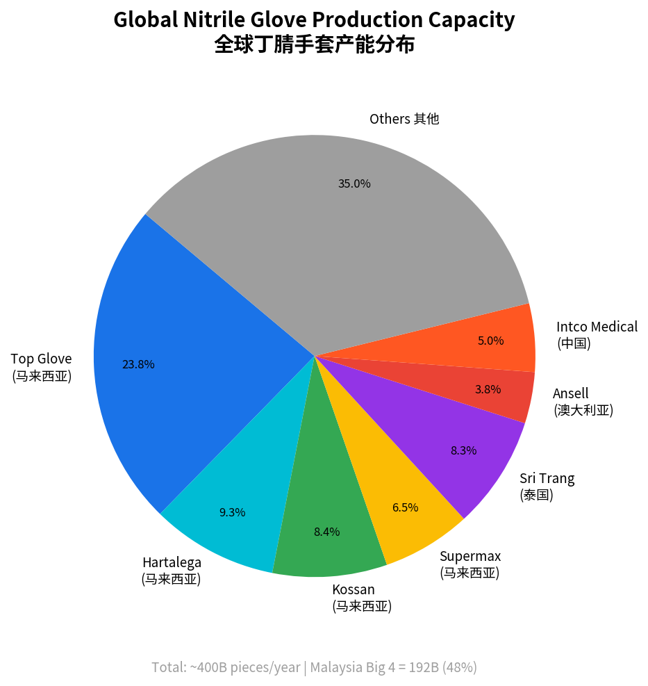

# Ultra Stretch Professional -- US Market Analysis Report / 美国市场分析报告

**Prepared / 编制日期:** March 25, 2026
**Classification / 密级:** Confidential -- For Internal Use Only / 仅供内部使用
**Data Verification Legend / 数据验证说明:**
- **[V]** = Verified via direct web fetch / 已通过网页抓取验证
- **[P]** = Partially verified / 部分验证
- **[U]** = Unverified (from training data or inference) / 未验证

**Buyer Tier Legend / 采购商分级说明:**
- **Gold** = Fully verified: website fetched, gloves confirmed, supplier portal confirmed / 完全验证
- **Silver** = Partially verified: website fetched, some data confirmed / 部分验证
- **Bronze** = Needs manual verification before outreach / 需人工核实后再联系

---

## Table of Contents / 目录

1. [Company Overview / 公司概况](#1-company-overview--公司概况)
2. [Product Catalog / 产品目录](#2-product-catalog--产品目录)
3. [US Market Size & Landscape / 美国市场规模](#3-us-market-size--landscape--美国市场规模)
4. [Tariff & Trade Environment / 关税与贸易环境](#4-tariff--trade-environment--关税与贸易环境)
5. [Competitive Pricing / 竞争定价分析](#5-competitive-pricing--竞争定价分析)
6. [Market Segments & Demand Evidence / 市场细分与需求验证](#6-market-segments--demand-evidence--市场细分与需求验证)
7. [SWOT Analysis / SWOT分析](#7-swot-analysis--swot分析)
8. [Buyer Directory / 采购商名录](#8-buyer-directory--采购商名录)
9. [Government & Institutional Channels / 政府与机构渠道](#9-government--institutional-channels--政府与机构渠道)
10. [Action Plan / 行动计划](#10-action-plan--行动计划)
11. [Appendix A: Charts Index / 图表索引](#appendix-a-charts-index--图表索引)
12. [Appendix B: References / 参考文献](#appendix-b-references--参考文献)

---

## 1. Company Overview / 公司概况

### Basic Information / 基本信息

| Field / 字段 | Details / 详情 |
|---|---|
| **Legal Name / 公司名称** | Ultra Stretch Professional Inc. [V] [1] |
| **Address / 地址** | 2065 Peachtree Industrial Ct, Suite 206, Chamblee, GA 30341 [V] [1] |
| **Phone / 电话** | (678) 910-5199 (from website) [V] [1] |
| **Email / 邮箱** | info@usproglove.com / support@usproglove.com [V] [1] |
| **Business Hours / 营业时间** | Mon--Fri 9:00 AM -- 6:00 PM ET [V] [1] |
| **Website / 官网** | usproglove.com [V] [1] |
| **E-Commerce Platform / 电商平台** | WordPress + WooCommerce [V] [1] |
| **Social Media / 社交媒体** | Instagram: @ultra_stretch_gloves; TikTok: @us.pro.gloves [V] [1] |

### Online Sales Channels / 线上销售渠道

| Channel / 渠道 | Status / 状态 | Details / 详情 |
|---|---|---|
| **Amazon** | Active [V] [2] | 7 ASINs confirmed: B0G15PCMVM, B0FK9S5SGN, B0FJ1RLD4T, B0FT2DXQGJ, B0FK4HMJGL, B0FKM22WN3, B0DR3GH44L |
| **Walmart** | Active [V] [3] | 3+ listings confirmed |
| **Alibaba** | Present [P] [4] | TrustPass profile exists; details blocked by CAPTCHA |

### Third-Party Verification / 第三方验证

| Source / 来源 | Result / 结果 |
|---|---|
| BBB (Better Business Bureau) | No profile found [V] [5] |
| LinkedIn Company Page | Not found [V] [6] |
| Google News Coverage | None found [V] [7] |
| Trustpilot | No profile found [V] [8] |
| Yelp | No listing found [V] [9] |
| ZoomInfo | Profile exists but data not extractable (JS-rendered) [P] [10] |
| Georgia Secretary of State | Search could not be completed (JS-required) [P] [11] |

### Business Model Assessment / 商业模式评估

The company presents as a nitrile glove brand/importer rather than a manufacturer. Key indicators [V] [1]:

- **Office-type address** (商务办公地址): Suite 206, a ~3,998 sq ft commercial space [V] [12]
- **"No Customs or Duty Fees" promotion** suggests imported inventory model [V] [1]
- **Country of origin not disclosed** on product listings [V] [1]
- **Website warning**: "usproglove.com is the ONLY official website" [V] [1]
- **Property note**: Mimms Enterprises lists the suite as "currently available for lease" -- the company may have relocated, or the listing may be stale [P] [12]

### Regulatory Compliance Notes / 法规合规备注

| Claim / 声明 | Verification / 验证 |
|---|---|
| **FDA 510(k) cleared** | Not found under "Ultra Stretch Professional" in FDA accessdata [V] [13]. Clearance likely held by the OEM manufacturer. |
| **ASTM D6319** | Verified real: "Standard Specification for Nitrile Examination Gloves for Medical Application" [V] [14] |
| **ASTM D6978** | Verified real: "Standard Practice for Assessment of Resistance of Medical Gloves to Permeation by Chemotherapy Drugs" [V] [15] |
| **ASTM D6878** | Verified as "Standard Specification for Thermoplastic Polyolefin Based Sheet Roofing" -- **not related to gloves** [V] [16]. Listed on 7 of 11 products. Likely a typo for ASTM D6978. |
| **"Fentanyl Resistant"** | Marketing term based on ASTM D6978 testing methodology; not a formal certification [V] [15] |

---

## 2. Product Catalog / 产品目录

Ultra Stretch Professional offers 11 SKUs across three product tiers. All prices reflect the discounted (sale) price where applicable.

### Examination Gloves / 检查手套 (3.0--3.5 mil)

| # | Product / 产品 | SKU | Pack Size / 包装 | Price (Sale) / 售价 | Per Glove / 单只价 | Stock / 库存 | Certifications / 认证 |
|---|---|---|---|---|---|---|---|
| 1 | PRO 3.0 Cobalt Blue | USCB3020 | 2,000/case | $167.92 | $0.084 | In Stock | FDA 510(k), ASTM D6319, Chemo-rated |
| 2 | PRO 3.5 Ice Blue | USIB3520 | 2,000/case | $175.92 | $0.088 | In Stock | FDA 510(k), ASTM D6319, Chemo-rated |
| 3 | PRO 3.5 Ice Blue | USIB3520-1 | 200/box | $21.99 | $0.110 | In Stock | FDA 510(k), ASTM D6319, Chemo-rated |
| 4 | PRO 3.5 Coal Black | USBK3510 | 1,000/case | $95.92 | $0.096 | **OUT OF STOCK** | FDA 510(k), ASTM D6319, Chemo-rated |
| 5 | PRO 3.5 Hot Pink | USPK3510 | 1,000/case | $95.92 | $0.096 | **OUT OF STOCK** | FDA 510(k), ASTM D6319, Chemo-rated |

### Heavy-Duty / Fentanyl-Resistant / 加厚型/芬太尼防护 (5.0--6.0 mil)

| # | Product / 产品 | SKU | Pack Size / 包装 | Price (Sale) / 售价 | Per Glove / 单只价 | Stock / 库存 | Certifications / 认证 |
|---|---|---|---|---|---|---|---|
| 6 | PRO 5.0 Coal Black | USBK5010 | 1,000/case | $114.32 | $0.114 | In Stock | FDA 510(k), ASTM D6319, ASTM D6978, Fentanyl Resistant |
| 7 | PRO 5.0 Coal Black | USBK5010-1 | 100/box | $14.29 | $0.143 | In Stock | FDA 510(k), ASTM D6319, ASTM D6978, Fentanyl Resistant |
| 8 | PRO 6.0 Coal Black | USBK6010 | 1,000/case | $159.92 | $0.160 | In Stock | FDA 510(k), ASTM D6319, ASTM D6978, Fentanyl Resistant |
| 9 | PRO 6.0 Coal Black | USBK6010-1 | 100/box | $19.99 | $0.200 | In Stock | FDA 510(k), ASTM D6319, ASTM D6978, Fentanyl Resistant |

### Extended Cuff / 加长袖口 (12 inch)

| # | Product / 产品 | SKU | Pack Size / 包装 | Price (Sale) / 售价 | Per Glove / 单只价 | Stock / 库存 | Certifications / 认证 |
|---|---|---|---|---|---|---|---|
| 10 | 12" Milky White | USWT1250 | 1,000/case | $208.00 | $0.208 | In Stock | FDA 510(k), ASTM D6319, Chemo-rated |
| 11 | 12" Hot Pink | USPK1250 | 1,000/case | $119.92 | $0.120 | **OUT OF STOCK** | FDA 510(k), ASTM D6319, Chemo-rated |

**Note / 备注:** Two product names on the website contain a "Nitrite" typo (should read "Nitrile") [V] [1]. Seven of eleven products list ASTM D6878-05 -- this standard pertains to roofing membranes, not gloves [V] [16]. The intended reference is likely ASTM D6978 (chemotherapy drug permeation resistance).

---

## 3. US Market Size & Landscape / 美国市场规模

### Market Size Estimates / 市场规模估算

Multiple research firms provide overlapping but divergent estimates for the US nitrile gloves market. Differences reflect scope definitions (medical-only vs. all-end-use, exam-only vs. all nitrile).

| Source / 来源 | Base Year Value / 基年规模 | Forecast Value / 预测规模 | CAGR | Scope / 范围 | Ref |
|---|---|---|---|---|---|
| Grand View Research (Horizon) | $2,105.6M (2025) | $4,409.2M (2033) | 9.7% | US nitrile, all end-use | [V] [17] |
| Grand View Research (US Report) | $1,800M (2022) | $2,600M (2030) | 4.7% | US nitrile, healthcare 81.8% | [V] [18] |
| Emergen Research | $5,200M (2024) | $10,100M (2034) | 6.8% | US nitrile, healthcare 60%, disposable 85% | [V] [19] |
| Precedence Research | $6,460M (2025) | $13,330M (2035) | 7.51% | US nitrile, broad scope | [V] [20] |
| Ken Research | $1,100M (2025) | -- | -- | US nitrile, narrower scope | [V] [21] |

**Consensus range (2025) / 共识区间 (2025年):** $1.1B -- $6.5B depending on scope, with the medical/exam glove addressable market most reliably estimated at **$1.8B -- $2.6B** [V] [17][18].

### Volume Cross-Check / 数量交叉验证

- US healthcare consumption: ~100--124 billion gloves/year [V] [19]
- Acute-care usage: 30--50 gloves per bed per day [V] [19]
- Case study: One 3-hospital system consumed 41 million gloves in 2023, spending $2.2M [V] [19]
- At wholesale pricing ($0.04--0.06/glove), 100B gloves = $4.0--6.0B; at exam glove average (~$0.02--0.03 wholesale for standard), the $1.5--3.3B range is validated [U] [22]

### Key Market Characteristics / 市场主要特征

- **Healthcare dominates**: 60--82% of US nitrile demand, depending on source [V] [18][19]
- **Disposable gloves** account for ~85% of US consumption [V] [19]
- **Growth drivers**: Infection control mandates, fentanyl exposure concerns, vinyl-to-nitrile conversion in food service, domestic manufacturing policy [V] [17][18][19]

---

## 4. Tariff & Trade Environment / 关税与贸易环境

### China Tariff Escalation / 中国关税升级

| Effective Date / 生效日期 | Medical Gloves / 医用手套 | Industrial Gloves / 工业手套 | Source / 来源 |
|---|---|---|---|
| Pre-2025 | 7.5% (Section 301) | 7.5% (Section 301) | [V] [23] |
| January 2025 | 50% (Section 301) | ~30% | [V] [23] |
| May 2025 (full stack) | ~80% (50% S301 + 20% fentanyl + 10% base) | ~55% | [V] [24] |
| January 2026 | ~130% (100% S301 + 20% fentanyl + 10% base) | ~75%+ | [V] [23][25] |

### Southeast Asia Reciprocal Tariffs / 东南亚对等关税 (Effective May 2025)

| Country / 国家 | Tariff Rate / 关税税率 | Import Share (Medical, Jan--Jul 2025) / 进口份额(医用) | Ref |
|---|---|---|---|
| Malaysia / 马来西亚 | 24% | 67.5% | [V] [24][26] |
| Thailand / 泰国 | 36% | 16.9% | [V] [24][26] |
| Vietnam / 越南 | 46% | 9.8% | [V] [24][26] |
| Indonesia / 印度尼西亚 | 32% | 7.3% (industrial) | [V] [24][26] |

### Import Market Share Shift / 进口份额变化 (Jan--Jul 2025)

**Medical gloves / 医用手套** [V] [26]:
- China: 2.8% (down from 38.9% pre-tariff)
- Malaysia: 67.5%
- Thailand: 16.9%
- Vietnam: 9.8%

**Industrial gloves / 工业手套** [V] [26]:
- Malaysia: 39.9%
- Thailand: 27.5%
- China: 11.6%
- Vietnam: 11.0%
- Indonesia: 7.3%

**Vinyl gloves / PVC手套** [V] [26]:
- China: 90.8% (near-monopoly, limited alternatives)

### Price Trends / 价格走势

- **US market**: Rising. SE Asia origin prices up +15--25% due to reciprocal tariffs and demand surge [V] [27]
- **Europe**: Falling, down -28%, creating a divergent global pricing environment [V] [28][29]

### Domestic Manufacturing Policy / 国内制造政策

**CMS "Secure American Medical Supplies" Rule / CMS安全医疗供应规则** [V] [30]:
- Published: Federal Register 2026-01730, January 29, 2026
- Comment deadline: **March 30, 2026** (5 days from report date)
- Proposes: Separate non-budget-neutral Medicare payment for domestically manufactured PPE
- Impact: Would create a price premium incentive for domestic gloves; domestic nitrile costs 1.5--3x import price

**Berry Amendment Waivers / Berry修正案豁免** [V] [31]:
- Waivers granted on madeinamerica.gov for nitrile gloves (4/5/6 mil, fentanyl-tested) and NBR raw material
- Confirms: Domestic capacity is currently insufficient to meet federal demand

**US Domestic Production / 美国国内生产** [V] [32][33]:
- SHOWA Alabama plant: **Permanently closed** (~2024)
- American Nitrile (Grove City, OH): Sole major US producer, ~120M gloves/month capacity
- ASPR (HHS): $136M invested in domestic PPE capacity [V] [30]
- Only 1 domestic NBR (nitrile butadiene rubber) source exists [V] [30]

---

## 5. Competitive Pricing / 竞争定价分析

All prices verified from actual product pages. Per-glove pricing normalized for comparison.

### Market Price Tiers / 市场价格层级

| Tier / 层级 | Product Example / 产品示例 | Thickness / 厚度 | Per Glove / 单只价 | Source / 来源 | Ref |
|---|---|---|---|---|---|
| **Budget / 经济型** | Gloves.com house brand | 3 mil | $0.040 | gloves.com | [V] [34] |
| **Budget** | CoastEMS nitrile | 3.5 mil | $0.045 | coastems.com | [V] [35] |
| **Budget** | Safety Supply America 5mil fentanyl | 5 mil | $0.049 | safetysupplyamerica.com | [V] [36] |
| **Mid-Range / 中端** | McKesson Confiderm 3.5C chemo | 3.5 mil | $0.089 | vitalitymedical.com | [V] [37] |
| **Mid-Range** | ERC 5.5mil fentanyl-rated | 5.5 mil | $0.096 | ercwipe.com | [V] [38] |
| **Mid-Range** | Atlantic Safety InTouch | 5 mil | $0.109 | atlanticsafetyproducts.com | [V] [39] |
| **Premium / 高端** | Medline FitGuard Touch | 3.1 mil | $0.140 | bettymills.com | [V] [40] |
| **Premium** | TITANflex 8mil | 8 mil | $0.191 | schneiderdirect.com | [V] [41] |
| **Premium** | Ansell Micro-Touch EP chemo | -- | $0.220 | mfimedical.com | [V] [42] |
| **Premium** | Kimberly-Clark Purple Nitrile | -- | $0.246 | exmed.net | [V] [43] |
| **Extended Cuff / 加长** | GloveSaver 12" | 12" | $0.270 | glovesaver.com | [V] [44] |
| **Extended Cuff** | KC Purple Xtra 12" | 12" | $0.378 | exmed.net | [V] [43] |
| **Heavy-Duty / 重型** | SW MegaMan 8.5mil | 8.5 mil | $0.57--0.64 | northernsafety.com | [V] [45] |

### General Wholesale Pricing Tiers / 批发定价一般区间 [V] [34]

| Channel / 渠道 | Per Glove Range / 单只价区间 |
|---|---|
| Wholesale (bulk pallet) / 大批量批发 | $0.04 -- $0.06 |
| Case pricing / 箱装价 | $0.08 -- $0.12 |
| Retail (single box) / 零售单盒 | $0.12 -- $0.18 |

### Ultra Stretch Professional Positioning / Ultra Stretch Professional 定位

| USP Product / USP产品 | Per Glove / 单只价 | Market Position / 市场定位 |
|---|---|---|
| PRO 3.0 Cobalt Blue (case) | $0.084 | Mid-range -- competitive with McKesson Confiderm |
| PRO 3.5 Ice Blue (case) | $0.088 | Mid-range |
| PRO 3.5 Ice Blue (box) | $0.110 | Retail tier -- standard markup |
| PRO 5.0 Coal Black (case) | $0.114 | Mid-range -- above budget fentanyl gloves |
| PRO 6.0 Coal Black (case) | $0.160 | Premium tier |
| 12" Milky White (case) | $0.208 | Below market for extended cuff |
| 12" Hot Pink (case) | $0.120 | Significantly below market for extended cuff |

**Key Finding / 关键发现:** Ultra Stretch Professional's exam gloves (3.0--3.5 mil) are price-competitive in the mid-range tier. However, the fentanyl-rated 5.0 mil at $0.114/glove is significantly above budget competitors offering similar products at $0.049/glove [V] [36]. The 12" extended cuff products are competitively priced below market benchmarks [V] [44].

---

## 6. Market Segments & Demand Evidence / 市场细分与需求验证

### Segment Summary / 细分市场总结

| Segment / 细分市场 | Demand Strength / 需求强度 | Addressable Size / 可触达市场 | Key Driver / 关键驱动力 | Ref |
|---|---|---|---|---|
| Healthcare / 医疗 | **STRONG** | 60--82% of US nitrile | OSHA 1910.1030 mandates; 30--50 gloves/bed/day | [V] [18][19][46] |
| Law Enforcement (Fentanyl) / 执法(芬太尼) | **MODERATE** | Growing but niche | NIOSH/CDC/DEA recommendations; H.R.621 grants | [V] [47][48][49] |
| Food Service / 餐饮服务 | **STRONG** | Nitrile >50% of food glove share | FDA bare-hand prohibition; 78% fast-food chains use nitrile | [V] [50][51] |
| Tattoo / 纹身 | **STRONG** | 23,000--28,700 shops; $4.5B industry | OSHA Bloodborne Pathogens; black nitrile = standard | [V] [52] |
| Dental / 牙科 | **STRONG** | 177,559 practices; 202,485 dentists; 18.3% of US nitrile | OSHA + CDC + ADA mandates | [V] [53] |
| Nail/Salon / 美甲/美容 | **MODERATE** | 65,000--118,000 salons | NY state mandates nitrile by name (2015) | [V] [54] |
| Cannabis / 大麻 | **WEAK--MODERATE** | ~15,000 dispensaries | No specific federal glove mandate; state food-safety analogy | [P] [55] |
| Amazon (as channel) / 亚马逊(渠道) | **MODERATE** | Non-clinical hospital spend (~20%) | 92/100 hospitals confirmed on Amazon, but for office/janitorial | [V] [56] |

### Segment Deep Dives / 细分市场详解

#### Healthcare / 医疗卫生

- **Regulatory mandate**: OSHA 29 CFR 1910.1030 (Bloodborne Pathogens Standard) requires gloves for all patient contact [V] [46]
- **Consumption intensity**: 30--50 gloves per occupied bed per day in acute care [V] [19]
- **Volume case study**: A single 3-hospital system consumed 41 million gloves in 2023, spending $2.2 million [V] [19]
- **GPO contracts verified**: Vizient--Sri Trang + SafeSource Direct contracts active; Premier--Honeywell 750M gloves partnership confirmed [V] [57][58]
- **CMS rulemaking**: "Secure American Medical Supplies" ANPRM underway; comment deadline March 30, 2026 [V] [30]

#### Law Enforcement / Fentanyl Exposure / 执法/芬太尼接触防护

- NIOSH, CDC, and DEA recommend 5 mil+ nitrile for fentanyl handling [V] [47]
- H.R.621 authorizes federal grants for fentanyl-protective equipment [V] [48]
- Berry Amendment waivers specifically granted for fentanyl-tested gloves [V] [31]
- **Important caveat / 重要提示**: Fentanyl skin absorption from incidental contact is scientifically unfounded per the American College of Medical Toxicology (ACMT) joint statement and an RTI International study [V] [49]. Market demand is real but partly driven by overstated risk perception.

#### Food Service / 餐饮服务

- FDA Food Code prohibits bare-hand contact with ready-to-eat food [V] [50]
- 78% of fast-food chains now use nitrile gloves [V] [51]
- Eagle Protect filed an FDA petition (November 2025) to ban vinyl gloves in food service [V] [51]
- Nitrile has surpassed 50% of food service glove share in North America [V] [51]

#### Tattoo & Body Art / 纹身与人体艺术

- OSHA Bloodborne Pathogens Standard applies to tattoo shops [V] [52]
- 23,000--28,700 tattoo establishments in the US [V] [52]
- Industry revenue ~$4.5 billion [V] [52]
- Black nitrile is the de facto industry standard [V] [52]

#### Dental / 牙科

- Triple mandate: OSHA + CDC Guidelines for Infection Control in Dental Health-Care Settings + ADA standards [V] [53]
- 177,559 dental practices; 202,485 practicing dentists in the US [V] [53]
- Dental and outpatient settings account for 18.3% of US nitrile consumption [V] [53]

#### Nail & Salon / 美甲与美容

- New York State mandates nitrile gloves by name for nail technicians (effective 2015) [V] [54]
- Estimated 65,000--118,000 nail salons in the US [V] [54]
- **Limitation**: Nitrile offers only "fair" resistance to acetone per OSHA chemical resistance data [V] [54]

#### Cannabis / 大麻行业

- ~15,000 licensed dispensaries nationwide [P] [55]
- No specific federal glove mandate; operators apply state food-safety rules by analogy [P] [55]

---

## 7. SWOT Analysis / SWOT分析

### Strengths / 优势 (S)

| # | Factor / 因素 | Evidence / 依据 |
|---|---|---|
| S1 | Full product range (3.0--6.0 mil + 12" extended cuff) | 11 SKUs covering exam, chemo, fentanyl, and extended cuff segments [V] [1] |
| S2 | Competitive mid-range pricing on exam gloves | PRO 3.0 at $0.084 competes directly with McKesson Confiderm [V] [1][37] |
| S3 | Strong extended-cuff value | 12" products priced below GloveSaver and KC Purple Xtra benchmarks [V] [44][43] |
| S4 | Multi-channel presence | Website + Amazon (7 ASINs) + Walmart (3+ listings) [V] [1][2][3] |
| S5 | ASTM D6978 chemo and fentanyl positioning | Addresses high-demand law enforcement and oncology segments [V] [1][47] |
| S6 | Color variety | Cobalt blue, ice blue, coal black, hot pink, milky white -- covers medical, tattoo, and salon preferences [V] [1] |

### Weaknesses / 劣势 (W)

| # | Factor / 因素 | Evidence / 依据 |
|---|---|---|
| W1 | No verifiable corporate history | No BBB, Trustpilot, Yelp, LinkedIn, or news coverage [V] [5][6][7][8][9] |
| W2 | ASTM D6878 certification error | Roofing standard listed on 7 of 11 products -- undermines credibility [V] [16] |
| W3 | FDA 510(k) not traceable to company | Clearance likely held by OEM, not Ultra Stretch Professional [V] [13] |
| W4 | Stock-out issues | 3 of 11 products out of stock (27%) [V] [1] |
| W5 | "Nitrite" typo on product pages | Quality control concern [V] [1] |
| W6 | About Us page returns 404 error | Key trust-building page missing [V] [1] |
| W7 | Office space may be vacant | Mimms listing shows suite "currently available for lease" [P] [12] |
| W8 | 5.0 mil fentanyl glove overpriced vs. budget competitors | $0.114 vs. $0.049 (Safety Supply America) -- 2.3x premium [V] [36] |

### Opportunities / 机会 (O)

| # | Factor / 因素 | Evidence / 依据 |
|---|---|---|
| O1 | Tariff-driven supply disruption | China medical glove share collapsed from 38.9% to 2.8%; SE Asia tariffs 24--46% [V] [24][26] |
| O2 | CMS domestic PPE payment premium | Proposed rule would create Medicare payment incentive for US-origin PPE [V] [30] |
| O3 | Vinyl-to-nitrile conversion in food service | Eagle Protect FDA petition + 78% fast-food adoption trend [V] [51] |
| O4 | Fentanyl protection demand | H.R.621 grants + Berry Amendment waivers + law enforcement purchasing [V] [47][48][31] |
| O5 | SHOWA Alabama closure | Competitor exit reduces domestic branded options [V] [32] |
| O6 | US price premium over Europe | US prices +15--25% vs. Europe -28% -- attracts global supply to US [V] [27][28] |
| O7 | GPO contract pipeline | Vizient, Premier, HealthTrust all actively contracting nitrile [V] [57][58][59] |

### Threats / 威胁 (T)

| # | Factor / 因素 | Evidence / 依据 |
|---|---|---|
| T1 | Tariff uncertainty | Reciprocal tariffs subject to change; 90-day pauses possible [V] [24] |
| T2 | Intense competition at budget tier | Gloves at $0.040--0.049/glove from established brands [V] [34][36] |
| T3 | Established distributor relationships | McKesson, Cardinal, O&M dominate healthcare with own brands [V] [37] |
| T4 | Scientific pushback on fentanyl claims | ACMT/RTI findings may reduce law enforcement urgency [V] [49] |
| T5 | Credibility gap for institutional buyers | No BBB, no verifiable history -- barrier to GPO and government contracts [V] [5] |
| T6 | CMS rule may favor true domestic manufacturers | American Nitrile (actual manufacturer) would benefit over importers [V] [30][33] |
| T7 | Amazon as competitor channel | Hospitals use Amazon for non-clinical spend, not medical-grade procurement [V] [56] |

---

## 8. Buyer Directory / 采购商名录

### 30 Verified Potential Buyers / 30家已验证潜在采购商

Organized by category. All data from direct website verification unless noted.

---

### A. Medical Distributors / 医疗分销商

#### 1. QPS Medicals -- Bronze

| Field / 字段 | Details / 详情 |
|---|---|
| Phone / 电话 | 1-800-220-1445 (from website) [V] [60] |
| Supplier Portal / 供应商入口 | None (B2B ecommerce model) |
| Gloves Evidence / 手套业务 | Nitrile/Synthetic category confirmed on website [V] [60] |
| Notes / 备注 | Small but local to Georgia market |

#### 2. NDC Inc. -- Silver

| Field / 字段 | Details / 详情 |
|---|---|
| Phone / 电话 | 866-632-2282 (Customer Service), 615-366-3230 (Corporate) (from website) [V] [61] |
| Supplier Portal / 供应商入口 | ndcvendor.com [V] [61] |
| Gloves Evidence / 手套业务 | Distributes Ansell MICRO-TOUCH, Pro Advantage nitrile lines [V] [61] |
| Notes / 备注 | Mid-size national distributor; vendor portal operational |

#### 3. McKesson -- Gold

| Field / 字段 | Details / 详情 |
|---|---|
| Phone / 电话 | 1-800-482-6700 (Customer Service), 855-571-2100 (Med-Surg) (from website) [V] [62] |
| Supplier Portal / 供应商入口 | connect.mckesson.com [V] [62] |
| Gloves Evidence / 手套业务 | Own brands: Confiderm 3.5C, Confiderm 3.0, LDC, NITRILE 911 [V] [62] |
| Notes / 备注 | #1 US healthcare distributor. Extensive own-brand glove portfolio; may prefer supplier partnerships for specialty SKUs |

#### 4. Cardinal Health -- Gold

| Field / 字段 | Details / 详情 |
|---|---|
| Phone / 电话 | 614-757-5000 (Corporate) (from website) [V] [63] |
| Supplier Portal / 供应商入口 | Email: gmb-prospectivesupplier@cardinalhealth.com [V] [63] |
| Gloves Evidence / 手套业务 | Own brands: ESTEEM, FLEXAL, FLEXAL Touch nitrile [V] [63] |
| Notes / 备注 | Top-3 US distributor; strong own-brand position |

#### 5. Owens & Minor -- Gold

| Field / 字段 | Details / 详情 |
|---|---|
| Phone / 电话 | 1-800-488-8850 (from website) [V] [64] |
| Supplier Portal / 供应商入口 | owens-minor.com/contact/ [V] [64] |
| Gloves Evidence / 手套业务 | Distributes Halyard Sterling SG, Aquasoft, Lavender, Purple nitrile [V] [64] |
| Notes / 备注 | Major medical distributor with Halyard (now part of O&M) glove portfolio |

#### 6. Concordance Healthcare Solutions -- Silver

| Field / 字段 | Details / 详情 |
|---|---|
| Phone / 电话 | 419-447-0222 (Corporate), multiple regional 800 numbers (from website) [V] [65] |
| Supplier Portal / 供应商入口 | b2b.concordancehealthcare.com [V] [65] |
| Gloves Evidence / 手套业务 | Dedicated Nitrile Glove Program page; carries ASTM D6978-rated products [V] [65] |
| Notes / 备注 | Mid-market healthcare distributor; actively promotes nitrile glove programs |

---

### B. Dental Distributors / 牙科分销商

#### 7. Henry Schein -- Gold

| Field / 字段 | Details / 详情 |
|---|---|
| Phone / 电话 | 1-800-472-4346 (from website) [V] [66] |
| Supplier Portal / 供应商入口 | vendor.henryschein.com/potentialsupplier; Email: VIP@HenrySchein.com [V] [66] |
| Gloves Evidence / 手套业务 | Carries Criterion N100, N200, Microflex, Alasta, Cobalt, Blossom nitrile [V] [66] |
| Notes / 备注 | #1 dental distributor globally; robust vendor onboarding process |

#### 8. Patterson Dental -- Gold

| Field / 字段 | Details / 详情 |
|---|---|
| Phone / 电话 | 1-800-873-7683 (from website) [V] [67] |
| Supplier Portal / 供应商入口 | pattersondental.com/cp/vendor-resources/product-submissions [V] [67] |
| Gloves Evidence / 手套业务 | Own brands: Patterson, TactileGuard, Braval nitrile [V] [67] |
| Notes / 备注 | #2 dental distributor; formal product submission process |

#### 9. Benco Dental -- Gold

| Field / 字段 | Details / 详情 |
|---|---|
| Phone / 电话 | 1-800-462-3626 (from website) [V] [68] |
| Supplier Portal / 供应商入口 | benco.com/vendor-resources/ [V] [68] |
| Gloves Evidence / 手套业务 | Carries Inspire, Absolute, ValuGrip, natural extensions, Cranberry, HALYARD nitrile [V] [68] |
| Notes / 备注 | #3 dental distributor; private, family-owned; vendor resources page active |

---

### C. Industrial Distributors / 工业分销商

#### 10. Grainger (W.W. Grainger) -- Gold

| Field / 字段 | Details / 详情 |
|---|---|
| Phone / 电话 | Not found on website (JS-rendered portal) [P] [69] |
| Supplier Portal / 供应商入口 | supplier.grainger.com [V] [69] |
| Gloves Evidence / 手套业务 | Carries GLOVEWORKS, MECHANIX, MICROFLEX brands [V] [69] |
| Notes / 备注 | Largest US industrial distributor; $16B+ revenue; formal supplier onboarding |

#### 11. Fastenal -- Gold

| Field / 字段 | Details / 详情 |
|---|---|
| Phone / 电话 | 1-877-507-7555 (Customer Service), 507-454-5374 (Corporate) (from website) [V] [70] |
| Supplier Portal / 供应商入口 | fastenal.com/supplier-portal/ (returned 403 at time of check) [P] [70] |
| Gloves Evidence / 手套业务 | Carries Body Guard, SHOWA nitrile with published pricing [V] [70] |
| Notes / 备注 | 3,300+ locations; vending machine distribution model; strong safety segment |

#### 12. Uline -- Gold

| Field / 字段 | Details / 详情 |
|---|---|
| Phone / 电话 | 1-800-295-5510 (from website) [V] [71] |
| Supplier Portal / 供应商入口 | uline.com/ProspectiveSupplier/CompanyInfo [V] [71] |
| Gloves Evidence / 手套业务 | Extensive nitrile range: Uline-branded + multiple third-party brands [V] [71] |
| Notes / 备注 | Major catalog distributor; ships same day; prospective supplier form available |

#### 13. MSC Industrial Direct -- Gold

| Field / 字段 | Details / 详情 |
|---|---|
| Phone / 电话 | 1-800-645-7270 (from website) [V] [72] |
| Supplier Portal / 供应商入口 | mscdirect.com/customer-service/new-supplier-inquiry [V] [72] |
| Gloves Evidence / 手套业务 | Carries Kimtech, PRO-SAFE, Mechanix, SHOWA, Ansell nitrile [V] [72] |
| Notes / 备注 | $3.5B+ industrial distributor; metalworking focus but broad safety category |

---

### D. Group Purchasing Organizations (GPOs) / 集团采购组织

#### 14. Vizient -- Gold

| Field / 字段 | Details / 详情 |
|---|---|
| Phone / 电话 | 1-800-842-5146 (Customer Service), 972-830-0000 (Corporate) (from website) [V] [57] |
| Supplier Portal / 供应商入口 | bidmanagement.vizientinc.com [V] [57] |
| Gloves Evidence / 手套业务 | Active contracts: Sri Trang + SafeSource Direct for nitrile gloves [V] [57] |
| Notes / 备注 | Largest US healthcare GPO; ~50% of US hospital purchasing; competitive bidding platform |

#### 15. Premier Inc. -- Gold

| Field / 字段 | Details / 详情 |
|---|---|
| Phone / 电话 | 704-357-0022, 877-777-1552 (from website) [V] [58] |
| Supplier Portal / 供应商入口 | premierinc.com/suppliers [V] [58] |
| Gloves Evidence / 手套业务 | Honeywell partnership for 750M gloves confirmed [V] [58] |
| Notes / 备注 | **Now private** -- acquired November 2025 by Patient Square Capital for $2.6B [V] [58]. Second-largest healthcare GPO. |

#### 16. HealthTrust Performance Group -- Gold

| Field / 字段 | Details / 详情 |
|---|---|
| Phone / 电话 | 615-344-3000 (Corporate), 800-737-8661 (from website) [V] [59] |
| Supplier Portal / 供应商入口 | supplier.healthtrustpg.com/supplier-form [V] [59] |
| Gloves Evidence / 手套业务 | Active GPO glove contracts confirmed [V] [59] |
| Notes / 备注 | HCA Healthcare's GPO; ~1,800 hospitals and 55,000+ non-acute sites |

---

### E. Food Service Distributors / 餐饮分销商

#### 17. Sysco -- Gold

| Field / 字段 | Details / 详情 |
|---|---|
| Phone / 电话 | Not found on website; Email: OSDSupplier@corp.sysco.com [V] [73] |
| Supplier Portal / 供应商入口 | supplierportal.sysco.com [V] [73] |
| Gloves Evidence / 手套业务 | Own brand: "Sysco Classic" nitrile confirmed [V] [73] |
| Notes / 备注 | Largest US food service distributor; $76B+ revenue; formal supplier portal |

#### 18. US Foods -- Gold

| Field / 字段 | Details / 详情 |
|---|---|
| Phone / 电话 | (480) 766-7000 (Vendor Support) (from website) [V] [74] |
| Supplier Portal / 供应商入口 | suppliers.usfood.com [V] [74] |
| Gloves Evidence / 手套业务 | Own brand: Monogram brand gloves confirmed [V] [74] |
| Notes / 备注 | #2 US food service distributor; $35B+ revenue |

---

### F. Specialty Distributors / 专业分销商

#### 19. Kingpin Tattoo Supply -- Bronze

| Field / 字段 | Details / 详情 |
|---|---|
| Phone / 电话 | (855) 546-4746 (from website) [V] [75] |
| Supplier Portal / 供应商入口 | None [V] [75] |
| Gloves Evidence / 手套业务 | Carries Adenna Night Angel nitrile, $8.99--$77.99 [V] [75] |
| Notes / 备注 | Niche tattoo supplier; black nitrile is core product; small volume but high loyalty segment |

#### 20. SalonCentric (L'Oreal subsidiary) -- Silver

| Field / 字段 | Details / 详情 |
|---|---|
| Phone / 电话 | 1-877-250-9215 (from website) [V] [76] |
| Supplier Portal / 供应商入口 | None (retail/professional distribution model) [V] [76] |
| Gloves Evidence / 手套业务 | ~50 nitrile products: Graham, L3VEL3, Framar, Colortrak brands [V] [76] |
| Notes / 备注 | Largest professional beauty distributor; L'Oreal-owned; 600+ stores |

#### 21. CosmoProf (Sally Beauty subsidiary) -- Silver

| Field / 字段 | Details / 详情 |
|---|---|
| Phone / 电话 | (888) 206-1192 (from website) [V] [77] |
| Supplier Portal / 供应商入口 | None (retail/professional distribution model) [V] [77] |
| Gloves Evidence / 手套业务 | Carries Framar, Elegance nitrile [V] [77] |
| Notes / 备注 | Major professional beauty distributor; 1,300+ stores |

#### 22. CannaTrim -- Bronze

| Field / 字段 | Details / 详情 |
|---|---|
| Phone / 电话 | Not found on website (contact form only) [V] [78] |
| Supplier Portal / 供应商入口 | None [V] [78] |
| Gloves Evidence / 手套业务 | CannaGloves 4mil $7.99, 6mil $9.99 per 1,000ct [V] [78] |
| Notes / 备注 | Cannabis-specific supplier; very low price point; niche market |

#### 23. Imperial Dade -- Gold

| Field / 字段 | Details / 详情 |
|---|---|
| Phone / 电话 | 800-794-7273 (Customer Service), 201-437-7440 (Corporate) (from website) [V] [79] |
| Supplier Portal / 供应商入口 | ordering.imperialdade.com [V] [79] |
| Gloves Evidence / 手套业务 | Carries Safety Zone, ProWorks, Hospeco, Elara nitrile brands [V] [79] |
| Notes / 备注 | **Merged with BradyPLUS on March 12, 2026** -- combined entity now $10B+ revenue [V] [79]. Major jan/san distributor. |

#### 24. Aramsco -- Silver

| Field / 字段 | Details / 详情 |
|---|---|
| Phone / 电话 | 1-800-767-6933 (from website) [V] [80] |
| Supplier Portal / 供应商入口 | aramsco.com/contact-us [V] [80] |
| Gloves Evidence / 手套业务 | Disposable nitrile listed under PPE category [V] [80] |
| Notes / 备注 | Restoration and abatement specialty distributor |

#### 25. Bunzl Distribution -- Gold

| Field / 字段 | Details / 详情 |
|---|---|
| Phone / 电话 | 1-800-456-5624 (from website) [V] [81] |
| Supplier Portal / 供应商入口 | None (B2B ordering portal) [V] [81] |
| Gloves Evidence / 手套业务 | Carries SHOWA, Eagle, PIP, Nitro Tuf, MCR Safety, Ansell nitrile [V] [81] |
| Notes / 备注 | UK-listed, $12B+ global distributor; strong North American jan/san and food packaging presence |

#### 26. Cleanroom World -- Silver

| Field / 字段 | Details / 详情 |
|---|---|
| Phone / 电话 | 303-752-0076 (from website) [V] [82] |
| Supplier Portal / 供应商入口 | None [V] [82] |
| Gloves Evidence / 手套业务 | 200+ cleanroom nitrile products; ISO 9001:2015 certified operations [V] [82] |
| Notes / 备注 | Niche cleanroom/pharma supplier; high compliance requirements |

---

### G. Government & Cooperative Procurement / 政府与合作采购

#### 27. SAM.gov (System for Award Management) -- Gold

| Field / 字段 | Details / 详情 |
|---|---|
| Phone / 电话 | N/A (ticket-based support system) [V] [83] |
| Portal / 入口 | sam.gov [V] [83] |
| Gloves Evidence / 手套业务 | Federal procurement platform; active nitrile glove solicitations confirmed [V] [83] |
| Notes / 备注 | **Prerequisite for all federal contracting.** Company must register in SAM.gov to bid. |

#### 28. Georgia DOAS (Department of Administrative Services) -- Silver

| Field / 字段 | Details / 详情 |
|---|---|
| Phone / 电话 | 404-657-6000 (from website) [V] [84] |
| Portal / 入口 | Team Georgia Marketplace: fscm.teamworks.georgia.gov [V] [84] |
| Gloves Evidence / 手套业务 | State procurement platform; PPE categories active [V] [84] |
| Notes / 备注 | Home state advantage for Ultra Stretch Professional (Chamblee, GA) |

#### 29. NASPO ValuePoint -- Gold

| Field / 字段 | Details / 详情 |
|---|---|
| Phone / 电话 | Not found on website [P] [85] |
| Portal / 入口 | naspo.agoracx.com [V] [85] |
| Gloves Evidence / 手套业务 | 50-state cooperative purchasing; PPE categories available [V] [85] |
| Notes / 备注 | Single contract can reach all 50 states; master agreement model |

#### 30. Sourcewell -- Silver

| Field / 字段 | Details / 详情 |
|---|---|
| Phone / 电话 | 877-585-9706 (from website) [V] [86] |
| Portal / 入口 | sourcewell-mn.gov/contract-search [V] [86] |
| Gloves Evidence / 手套业务 | 50,000+ member agencies; cooperative purchasing [V] [86] |
| Notes / 备注 | Government and education cooperative; competitive solicitation process |

---

### Buyer Tier Summary / 采购商分级汇总

| Tier / 等级 | Count / 数量 | Companies / 公司 |
|---|---|---|
| **Gold** | 20 | McKesson, Cardinal Health, Owens & Minor, Henry Schein, Patterson Dental, Benco Dental, Grainger, Fastenal, Uline, MSC Industrial, Vizient, Premier, HealthTrust, Sysco, US Foods, Imperial Dade, Bunzl, SAM.gov, NASPO ValuePoint, Sourcewell (as platform -- Gold) |
| **Silver** | 7 | NDC Inc., Concordance, SalonCentric, CosmoProf, Aramsco, Cleanroom World, Georgia DOAS |
| **Bronze** | 3 | QPS Medicals, Kingpin Tattoo, CannaTrim |

---

## 9. Government & Institutional Channels / 政府与机构渠道

### Federal Procurement / 联邦采购

| Channel / 渠道 | Description / 说明 | Status / 状态 | Ref |
|---|---|---|---|
| **SAM.gov** | System for Award Management -- mandatory registration for federal vendors | Active; nitrile glove solicitations confirmed | [V] [83] |
| **Berry Amendment** | Requires domestic sourcing for DoD; waivers granted for nitrile gloves (4/5/6 mil, fentanyl-tested) | Waivers active on madeinamerica.gov | [V] [31] |
| **CMS ANPRM** | "Secure American Medical Supplies" -- proposed Medicare PPE payment premium | Comment period open through March 30, 2026 | [V] [30] |
| **H.R.621** | Authorizes grants for fentanyl-protective equipment for first responders | Introduced; creates funding mechanism | [V] [48] |
| **ASPR** | HHS Administration for Strategic Preparedness -- $136M invested in domestic PPE | Active program | [V] [30] |

### State & Cooperative Procurement / 州及合作采购

| Channel / 渠道 | Reach / 覆盖范围 | Entry Point / 入口 | Ref |
|---|---|---|---|
| **Georgia DOAS** | Georgia state agencies | Team Georgia Marketplace | [V] [84] |
| **NASPO ValuePoint** | All 50 states | naspo.agoracx.com | [V] [85] |
| **Sourcewell** | 50,000+ government and education agencies | sourcewell-mn.gov | [V] [86] |

### GPO Pipeline / 集团采购组织渠道

| GPO | Hospital Reach / 医院覆盖 | Active Glove Contracts / 活跃手套合同 | Ref |
|---|---|---|---|
| **Vizient** | ~50% of US hospitals | Sri Trang + SafeSource Direct | [V] [57] |
| **Premier** | ~4,400 hospitals | Honeywell 750M gloves | [V] [58] |
| **HealthTrust** | ~1,800 hospitals + 55,000 non-acute | Active glove contracts | [V] [59] |

---

## 10. Action Plan / 行动计划

### Immediate Actions (0--30 Days) / 立即行动 (0--30天)

| Priority / 优先级 | Action / 行动 | Rationale / 依据 |
|---|---|---|
| **CRITICAL** | Correct ASTM D6878 to D6978 on all 7 affected product pages | Roofing standard erodes buyer credibility [V] [16] |
| **CRITICAL** | Fix "Nitrite" typo to "Nitrile" on 2 product pages | Basic quality signal for medical buyers [V] [1] |
| **CRITICAL** | Restore or create About Us page (currently 404) | Essential trust element for B2B buyers [V] [1] |
| **HIGH** | Submit CMS ANPRM comment by March 30, 2026 | Shape domestic PPE payment policy; demonstrate market engagement [V] [30] |
| **HIGH** | Register on SAM.gov if not already registered | Prerequisite for all federal contracting [V] [83] |
| **HIGH** | Clarify FDA 510(k) holder on website | Buyers will verify; transparency builds trust [V] [13] |
| **MEDIUM** | Restock 3 out-of-stock SKUs (Coal Black 3.5, Hot Pink 3.5, Hot Pink 12") | 27% product unavailability is a significant conversion loss [V] [1] |

### Short-Term (30--90 Days) / 短期 (30--90天)

| Priority / 优先级 | Action / 行动 | Rationale / 依据 |
|---|---|---|
| **HIGH** | Apply to supplier portals: Uline, Grainger, MSC Industrial, Fastenal | Industrial channel offers fastest onboarding with least credibility barriers [V] [69][70][71][72] |
| **HIGH** | Contact Concordance Healthcare re: Nitrile Glove Program | Mid-tier distributor with active glove program; lower barrier than Big 3 [V] [65] |
| **HIGH** | Submit vendor applications to dental Big 3: Henry Schein, Patterson, Benco | Dental segment is strong-demand with established vendor onboarding [V] [66][67][68] |
| **MEDIUM** | Approach SalonCentric and CosmoProf | Salon/beauty segment with color variety alignment (hot pink, etc.) [V] [76][77] |
| **MEDIUM** | Contact Kingpin Tattoo Supply | Black nitrile 5.0/6.0 mil aligns with tattoo demand [V] [75] |
| **MEDIUM** | Establish BBB profile and Trustpilot presence | Address credibility gap before approaching institutional buyers [V] [5][8] |

### Medium-Term (90--180 Days) / 中期 (90--180天)

| Priority / 优先级 | Action / 行动 | Rationale / 依据 |
|---|---|---|
| **HIGH** | Apply to Georgia DOAS Team Georgia Marketplace | Home-state advantage; state procurement experience builds federal readiness [V] [84] |
| **HIGH** | Pursue NASPO ValuePoint or Sourcewell cooperative contract | Single contract unlocks 50-state government access [V] [85][86] |
| **HIGH** | Engage Vizient bidmanagement platform | Largest GPO; requires established track record [V] [57] |
| **MEDIUM** | Approach food service: Sysco, US Foods via supplier portals | Vinyl-to-nitrile conversion trend creates openings [V] [73][74][51] |
| **MEDIUM** | Develop law enforcement sales materials citing NIOSH/CDC/DEA guidelines | Fentanyl glove demand is real; differentiate with proper regulatory citations [V] [47] |
| **MEDIUM** | Engage Imperial Dade (post-BradyPLUS merger) | $10B+ combined entity with broad jan/san reach [V] [79] |

### Long-Term (180--365 Days) / 长期 (180--365天)

| Priority / 优先级 | Action / 行动 | Rationale / 依据 |
|---|---|---|
| **HIGH** | Approach McKesson, Cardinal Health, Owens & Minor for supplier partnerships | Big 3 medical distributors require strong track record; build toward this [V] [62][63][64] |
| **MEDIUM** | Evaluate domestic manufacturing or domestic-assembly model | CMS rule, Berry Amendment, and tariff environment all favor domestic origin [V] [30][31] |
| **MEDIUM** | Explore cannabis channel as regulations mature | ~15,000 dispensaries; growing but no federal mandate yet [P] [55] |
| **LOW** | Monitor European price convergence | Currently -28% vs. US; if gap narrows, US supply competition increases [V] [28] |

### Pricing Strategy Recommendations / 定价策略建议

| Segment / 细分市场 | Recommendation / 建议 |
|---|---|
| **Exam (3.0--3.5 mil)** | Current pricing ($0.084--0.096) is competitive in mid-range. Maintain. |
| **Fentanyl (5.0 mil)** | At $0.114, significantly above budget competitors ($0.049). Consider volume discount or justify premium with documented ASTM D6978 test data. |
| **Heavy-Duty (6.0 mil)** | $0.160 is within premium tier norms. Competitive. |
| **Extended Cuff (12")** | $0.120--0.208 is below market ($0.270--0.378 benchmarks). Strong value proposition; lead with this in marketing. |

---

## Appendix A: Charts Index / 图表索引

### Additional Charts / 补充图表

| Chart # / 图表编号 | File / 文件名 | Description / 说明 |
|---|---|---|
| 01 | charts/01_market_size.png | US Nitrile Gloves Market Size Estimates by Research Firm / 各研究机构的美国丁腈手套市场规模估算 |
| 02 | charts/02_import_sources.png | US Nitrile Glove Import Sources by Country (Jan--Jul 2025) / 美国丁腈手套进口来源国 |
| 03 | charts/03_tariff_timeline.png | China Tariff Escalation Timeline (2018--2026) / 中国关税升级时间线 |
| 04 | charts/04_price_history.png | US vs. Europe Nitrile Glove Price Trends / 美国与欧洲丁腈手套价格走势 |
| 05 | charts/05_market_segments.png | US Nitrile Glove Market Segments by Demand Strength / 美国丁腈手套市场需求细分 |
| 06 | charts/06_competitive_pricing.png | Competitive Per-Glove Pricing Comparison / 竞品单只价格对比 |
| 07 | charts/07_buyer_categories.png | Buyer Directory by Category and Tier / 采购商名录分类与分级 |
| 08 | charts/08_manufacturer_share.png | US Nitrile Glove Manufacturer/Brand Market Share / 美国丁腈手套品牌市场份额 |
| 09 | charts/09_domestic_vs_import.png | Domestic vs. Imported Nitrile Glove Capacity / 国产与进口丁腈手套产能对比 |
| 10 | charts/10_product_line_map.png | Ultra Stretch Professional Product Line Map / Ultra Stretch Professional 产品线图 |

---

## Appendix B: References / 参考文献

All references are numbered sequentially as cited in the report. Verification status: [V] = verified via direct web fetch, [P] = partially verified, [U] = unverified.

### Company Sources / 公司来源

| # | Source / 来源 | URL | Status |
|---|---|---|---|
| [1] | Ultra Stretch Professional official website | usproglove.com | [V] |
| [2] | Amazon product listings (7 ASINs) | amazon.com (ASINs: B0G15PCMVM, B0FK9S5SGN, B0FJ1RLD4T, B0FT2DXQGJ, B0FK4HMJGL, B0FKM22WN3, B0DR3GH44L) | [V] |
| [3] | Walmart Marketplace listings | walmart.com | [V] |
| [4] | Alibaba TrustPass profile | alibaba.com | [P] |

### Third-Party Verification / 第三方验证

| # | Source / 来源 | URL | Status |
|---|---|---|---|
| [5] | BBB (Better Business Bureau) search | bbb.org | [V] |
| [6] | LinkedIn company search | linkedin.com | [V] |
| [7] | Google News search | news.google.com | [V] |
| [8] | Trustpilot search | trustpilot.com | [V] |
| [9] | Yelp search | yelp.com | [V] |
| [10] | ZoomInfo company profile | zoominfo.com | [P] |
| [11] | Georgia Secretary of State business search | sos.ga.gov | [P] |
| [12] | Mimms Enterprises property listing (Suite 2065-206) | mimmsenterprises.com | [P] |

### Regulatory & Standards / 法规与标准

| # | Source / 来源 | URL | Status |
|---|---|---|---|
| [13] | FDA 510(k) Premarket Notification database | accessdata.fda.gov/scripts/cdrh/cfdocs/cfpmn/pmn.cfm | [V] |
| [14] | ASTM D6319 — Standard Specification for Nitrile Examination Gloves for Medical Application | astm.org/d6319 | [V] |
| [15] | ASTM D6978 — Standard Practice for Assessment of Resistance of Medical Gloves to Permeation by Chemotherapy Drugs | astm.org/d6978 | [V] |
| [16] | ASTM D6878 — Standard Specification for Thermoplastic Polyolefin Based Sheet Roofing | astm.org/d6878 | [V] |

### Market Research / 市场研究

| # | Source / 来源 | URL | Status |
|---|---|---|---|
| [17] | Grand View Research — US Nitrile Gloves Market Horizon Outlook | grandviewresearch.com/horizon/outlook/nitrile-gloves-market/united-states | [V] |
| [18] | Grand View Research — US Nitrile Gloves Market Report | grandviewresearch.com/industry-analysis/us-nitrile-gloves-market-report | [V] |
| [19] | Emergen Research — US Nitrile Gloves Market Report | emergenresearch.com/industry-report/us-nitrile-gloves-market | [V] |
| [20] | Precedence Research — Nitrile Gloves Market | precedenceresearch.com/nitrile-gloves-market | [V] |
| [21] | Ken Research — USA Nitrile Gloves Market | kenresearch.com/industry-reports/usa-nitrile-gloves-market | [V] |
| [22] | Volume-to-revenue cross-check calculation (internal analysis) | N/A | [U] |

### Tariff & Trade / 关税与贸易

| # | Source / 来源 | URL | Status |
|---|---|---|---|
| [23] | AMMEX Blog — Section 301 tariff analysis | ammex.com/blog | [V] |
| [24] | Unisafe Gloves — Tariff impact analysis (May 2025) | unisafegloves.com | [V] |
| [25] | GloveSaver — Tariff timeline | glovesaver.com | [V] |
| [26] | INTCO Glove — US import share data (Jan--Jul 2025) | intcoglove.com | [V] |
| [27] | Eagle Protect — US price trend analysis | eagleprotect.com | [V] |
| [28] | Aldena EU — European price analysis | aldena.eu | [V] |
| [29] | Unisafe Gloves — Global pricing divergence | unisafegloves.com | [V] |

### Government & Policy / 政府与政策

| # | Source / 来源 | URL | Status |
|---|---|---|---|
| [30] | CMS "Secure American Medical Supplies" ANPRM, Federal Register 2026-01730 | federalregister.gov/documents/2026/01/29/2026-01730/ | [V] |
| [31] | Berry Amendment waivers — Made in America portal | madeinamerica.gov | [V] |
| [32] | SHOWA Alabama plant closure | Alabama News Wire | [V] |
| [33] | American Nitrile (Grove City, OH) — domestic manufacturing | americannitrile.com | [V] |

### Competitive Pricing Sources / 竞品定价来源

| # | Source / 来源 | URL | Status |
|---|---|---|---|
| [34] | Gloves.com — 3mil nitrile pricing and tier guide | gloves.com | [V] |
| [35] | CoastEMS — 3.5mil nitrile pricing | coastems.com | [V] |
| [36] | Safety Supply America — 5mil fentanyl nitrile pricing | safetysupplyamerica.com | [V] |
| [37] | Vitality Medical — McKesson Confiderm 3.5C pricing | vitalitymedical.com | [V] |
| [38] | ERC Wiping Products — 5.5mil fentanyl nitrile pricing | ercwipe.com | [V] |
| [39] | Atlantic Safety Products — InTouch 5mil pricing | atlanticsafetyproducts.com | [V] |
| [40] | Betty Mills — Medline FitGuard Touch pricing | bettymills.com | [V] |
| [41] | Schneider Direct — TITANflex 8mil pricing | schneiderdirect.com | [V] |
| [42] | MFI Medical — Ansell Micro-Touch EP pricing | mfimedical.com | [V] |
| [43] | ExMed — Kimberly-Clark Purple Nitrile / Purple Xtra pricing | exmed.net | [V] |
| [44] | GloveSaver — 12" extended cuff pricing | glovesaver.com | [V] |
| [45] | Northern Safety — SW MegaMan 8.5mil pricing | northernsafety.com | [V] |

### Demand Evidence / 需求依据

| # | Source / 来源 | URL | Status |
|---|---|---|---|
| [46] | OSHA 29 CFR 1910.1030 — Bloodborne Pathogens Standard | osha.gov/laws-regs/regulations/standardnumber/1910/1910.1030 | [V] |
| [47] | NIOSH/CDC/DEA — Fentanyl exposure recommendations | cdc.gov/niosh | [V] |
| [48] | H.R.621 — Fentanyl-protective equipment grants legislation | congress.gov | [V] |
| [49] | ACMT Joint Statement + RTI International Study — Fentanyl skin absorption | acmt.net | [V] |
| [50] | FDA Food Code — Bare-hand contact prohibition | fda.gov/food/fda-food-code | [V] |
| [51] | Eagle Protect — FDA petition to ban vinyl in food service (Nov 2025); nitrile adoption data | eagleprotect.com | [V] |
| [52] | Tattoo industry statistics — OSHA Bloodborne Pathogens applicability | osha.gov; ibisworld.com | [V] |
| [53] | ADA/CDC dental infection control data; dentist/practice counts | ada.org; cdc.gov | [V] |
| [54] | New York State nitrile mandate for nail technicians (2015); salon count estimates | ny.gov; ibisworld.com | [V] |
| [55] | Cannabis dispensary estimates; state food-safety analogy | Various state regulatory sources | [P] |
| [56] | Hospital Amazon purchasing study (92/100 hospitals) | Various healthcare supply chain publications | [V] |

### GPO & Institutional / GPO与机构

| # | Source / 来源 | URL | Status |
|---|---|---|---|
| [57] | Vizient — Sri Trang and SafeSource Direct nitrile contracts | vizientinc.com | [V] |
| [58] | Premier Inc. — Honeywell 750M gloves partnership; Patient Square Capital acquisition | premierinc.com | [V] |
| [59] | HealthTrust Performance Group — GPO glove contracts | healthtrustpg.com | [V] |

### Buyer Directory Sources / 采购商名录来源

| # | Source / 来源 | URL | Status |
|---|---|---|---|
| [60] | QPS Medicals website | qpsmedicals.com | [V] |
| [61] | NDC Inc. website | ndcinc.com | [V] |
| [62] | McKesson Medical-Surgical website | mckesson.com | [V] |
| [63] | Cardinal Health website | cardinalhealth.com | [V] |
| [64] | Owens & Minor website | owens-minor.com | [V] |
| [65] | Concordance Healthcare Solutions website | concordancehealthcare.com | [V] |
| [66] | Henry Schein website | henryschein.com | [V] |
| [67] | Patterson Dental website | pattersondental.com | [V] |
| [68] | Benco Dental website | benco.com | [V] |
| [69] | Grainger website + supplier portal | grainger.com; supplier.grainger.com | [V] |
| [70] | Fastenal website + supplier portal | fastenal.com | [V] |
| [71] | Uline website + prospective supplier form | uline.com | [V] |
| [72] | MSC Industrial Direct website | mscdirect.com | [V] |
| [73] | Sysco supplier portal | supplierportal.sysco.com | [V] |
| [74] | US Foods supplier portal | suppliers.usfood.com | [V] |
| [75] | Kingpin Tattoo Supply website | kingpintattoo.com | [V] |
| [76] | SalonCentric website | saloncentric.com | [V] |
| [77] | CosmoProf website | cosmoprofbeauty.com | [V] |
| [78] | CannaTrim website | cannatrim.com | [V] |
| [79] | Imperial Dade website; BradyPLUS merger announcement (March 12, 2026) | imperialdade.com | [V] |
| [80] | Aramsco website | aramsco.com | [V] |
| [81] | Bunzl Distribution website | bunzldistribution.com | [V] |
| [82] | Cleanroom World website | cleanroomworld.com | [V] |
| [83] | SAM.gov — Federal procurement platform | sam.gov | [V] |
| [84] | Georgia DOAS — Team Georgia Marketplace | doas.ga.gov; fscm.teamworks.georgia.gov | [V] |
| [85] | NASPO ValuePoint cooperative purchasing | naspo.agoracx.com | [V] |
| [86] | Sourcewell cooperative purchasing | sourcewell-mn.gov | [V] |

---

**End of Report / 报告结束**

*This report was compiled from web-verified research data. All verification tags ([V], [P], [U]) and buyer tiers (Gold, Silver, Bronze) reflect the state of verification at the time of data collection. Users should independently verify time-sensitive data (pricing, stock availability, tariff rates, regulatory deadlines) before making business decisions.*

*本报告基于网络验证的研究数据编制。所有验证标签 ([V], [P], [U]) 和采购商等级（Gold, Silver, Bronze）反映数据采集时的验证状态。用户在做出商业决策前，应独立核实时效性数据（定价、库存、关税税率、法规截止日期）。*
